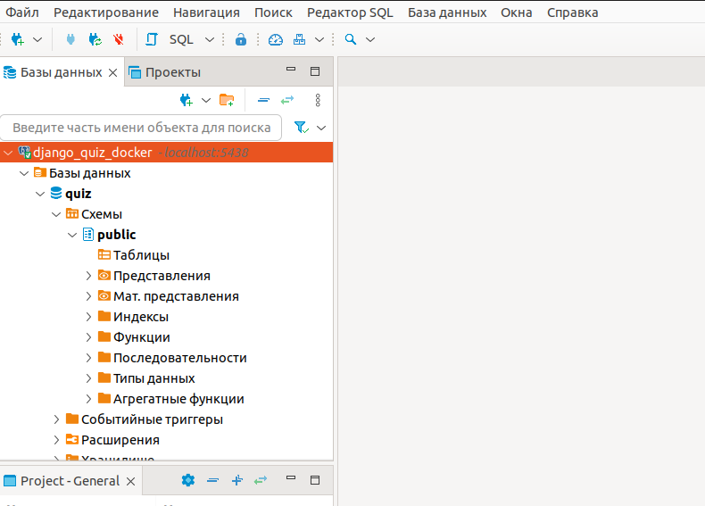
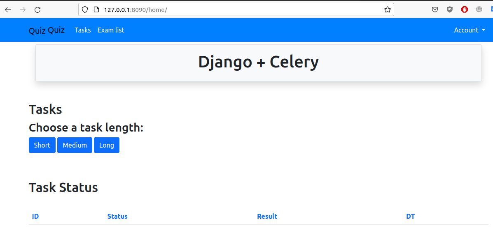

# DJANGO_QUIZ_DOCKER
-----------------------------------------------------------------------------------------------------------------------
Hillel python_advanced_15032022 learning project

Student: Кардашев Константин

------------------------------------------------------------------------------------------------------------------------

Тестовые аккаунты

    user_2 ||  user_2@test.com  || testpass1234 ||

    admin ||  admin@test.com  || superpass123 || 

------------------------------------------------------------------------------------------------------------------------
ПРОБЛЕМА: Стэк не хочет подключаться к постгресу.  ДЗ 27. Миграция QUIZ (DZ27_QuizMigration) . 
------------------------------------------------------------------------------------------------------------------------
Сборка не хочет подключаться к постгресс. Выдаёт такую ошибку:

    worker_service | django.db.utils.OperationalError: connection to server on socket "/var/run/postgresql/.s.PGSQL.5432" failed: No such file or directory
    worker_service | 	Is the server running locally and accepting connections on that socket?

Ни миграции, ни суперюзера сделать не даёт:

    user@user-X751SA:~/PycharmProjects/DJANGO/DJANGO_QUIZ_DOCKER/src$ docker-compose exec web bash
    root@ae8b68263837:/opt/src# python manage.py migrate
    Traceback (most recent call last):
      File "/usr/local/lib/python3.10/site-packages/django/db/backends/base/base.py", line 244, in ensure_connection
        self.connect()
      File "/usr/local/lib/python3.10/site-packages/django/utils/asyncio.py", line 26, in inner
        return func(*args, **kwargs)
      File "/usr/local/lib/python3.10/site-packages/django/db/backends/base/base.py", line 225, in connect
        self.connection = self.get_new_connection(conn_params)
      File "/usr/local/lib/python3.10/site-packages/django/utils/asyncio.py", line 26, in inner
        return func(*args, **kwargs)
      File "/usr/local/lib/python3.10/site-packages/django/db/backends/postgresql/base.py", line 203, in get_new_connection
        connection = Database.connect(**conn_params)
      File "/usr/local/lib/python3.10/site-packages/psycopg2/__init__.py", line 122, in connect
        conn = _connect(dsn, connection_factory=connection_factory, **kwasync)
    psycopg2.OperationalError: connection to server on socket "/var/run/postgresql/.s.PGSQL.5432" failed: No such file or directory
        Is the server running locally and accepting connections on that socket?
    
    
    The above exception was the direct cause of the following exception:
    
    Traceback (most recent call last):
      File "/opt/src/manage.py", line 22, in <module>
        main()
      File "/opt/src/manage.py", line 18, in main
        execute_from_command_line(sys.argv)
      File "/usr/local/lib/python3.10/site-packages/django/core/management/__init__.py", line 446, in execute_from_command_line
        utility.execute()
      File "/usr/local/lib/python3.10/site-packages/django/core/management/__init__.py", line 440, in execute
        self.fetch_command(subcommand).run_from_argv(self.argv)
      File "/usr/local/lib/python3.10/site-packages/django/core/management/base.py", line 414, in run_from_argv
        self.execute(*args, **cmd_options)
      File "/usr/local/lib/python3.10/site-packages/django/core/management/base.py", line 460, in execute
        output = self.handle(*args, **options)
      File "/usr/local/lib/python3.10/site-packages/django/core/management/base.py", line 98, in wrapped
        res = handle_func(*args, **kwargs)
      File "/usr/local/lib/python3.10/site-packages/django/core/management/commands/migrate.py", line 91, in handle
        self.check(databases=[database])
      File "/usr/local/lib/python3.10/site-packages/django/core/management/base.py", line 487, in check
        all_issues = checks.run_checks(
      File "/usr/local/lib/python3.10/site-packages/django/core/checks/registry.py", line 88, in run_checks
        new_errors = check(app_configs=app_configs, databases=databases)
      File "/usr/local/lib/python3.10/site-packages/django/core/checks/model_checks.py", line 36, in check_all_models
        errors.extend(model.check(**kwargs))
      File "/usr/local/lib/python3.10/site-packages/django/db/models/base.py", line 1461, in check
        *cls._check_indexes(databases),
      File "/usr/local/lib/python3.10/site-packages/django/db/models/base.py", line 1864, in _check_indexes
        connection.features.supports_covering_indexes
      File "/usr/local/lib/python3.10/site-packages/django/utils/functional.py", line 49, in __get__
        res = instance.__dict__[self.name] = self.func(instance)
      File "/usr/local/lib/python3.10/site-packages/django/db/backends/postgresql/features.py", line 84, in is_postgresql_11
        return self.connection.pg_version >= 110000
      File "/usr/local/lib/python3.10/site-packages/django/utils/functional.py", line 49, in __get__
        res = instance.__dict__[self.name] = self.func(instance)
      File "/usr/local/lib/python3.10/site-packages/django/db/backends/postgresql/base.py", line 354, in pg_version
        with self.temporary_connection():
      File "/usr/local/lib/python3.10/contextlib.py", line 135, in __enter__
        return next(self.gen)
      File "/usr/local/lib/python3.10/site-packages/django/db/backends/base/base.py", line 639, in temporary_connection
        with self.cursor() as cursor:
      File "/usr/local/lib/python3.10/site-packages/django/utils/asyncio.py", line 26, in inner
        return func(*args, **kwargs)
      File "/usr/local/lib/python3.10/site-packages/django/db/backends/base/base.py", line 284, in cursor
        return self._cursor()
      File "/usr/local/lib/python3.10/site-packages/django/db/backends/base/base.py", line 260, in _cursor
        self.ensure_connection()
      File "/usr/local/lib/python3.10/site-packages/django/utils/asyncio.py", line 26, in inner
        return func(*args, **kwargs)
      File "/usr/local/lib/python3.10/site-packages/django/db/backends/base/base.py", line 243, in ensure_connection
        with self.wrap_database_errors:
      File "/usr/local/lib/python3.10/site-packages/django/db/utils.py", line 91, in __exit__
        raise dj_exc_value.with_traceback(traceback) from exc_value
      File "/usr/local/lib/python3.10/site-packages/django/db/backends/base/base.py", line 244, in ensure_connection
        self.connect()
      File "/usr/local/lib/python3.10/site-packages/django/utils/asyncio.py", line 26, in inner
        return func(*args, **kwargs)
      File "/usr/local/lib/python3.10/site-packages/django/db/backends/base/base.py", line 225, in connect
        self.connection = self.get_new_connection(conn_params)
      File "/usr/local/lib/python3.10/site-packages/django/utils/asyncio.py", line 26, in inner
        return func(*args, **kwargs)
      File "/usr/local/lib/python3.10/site-packages/django/db/backends/postgresql/base.py", line 203, in get_new_connection
        connection = Database.connect(**conn_params)
      File "/usr/local/lib/python3.10/site-packages/psycopg2/__init__.py", line 122, in connect
        conn = _connect(dsn, connection_factory=connection_factory, **kwasync)
    django.db.utils.OperationalError: connection to server on socket "/var/run/postgresql/.s.PGSQL.5432" failed: No such file or directory
        Is the server running locally and accepting connections on that socket?

При этом через дебивер спокойно можно подключиться к базе на 5438 порту.:

На сайт приложения также можно зайти.

Команда  `sudo docker container inspect db_service | grep IPAddress` выдаёт следующее:

     "SecondaryIPAddresses": null,
            "IPAddress": "",
                    "IPAddress": "172.19.0.2",

Полная простыня вывода в терминале выглядит вот так:

    user@user-X751SA:~/PycharmProjects/DJANGO/DJANGO_QUIZ_DOCKER/src$ docker-compose up
    [+] Running 7/0
     ⠿ Container backend_service    Created                                                        0.0s
     ⠿ Container broker_service     Created                                                        0.0s
     ⠿ Container db_service         Created                                                        0.0s
     ⠿ Container nginx_service      Created                                                        0.0s
     ⠿ Container web_service        Created                                                        0.0s
     ⠿ Container scheduler_service  Created                                                        0.0s
     ⠿ Container worker_service     Created                                                        0.0s
    Attaching to backend_service, broker_service, db_service, nginx_service, scheduler_service, web_service, worker_service
    backend_service    | 1:C 16 Jul 2022 12:58:16.099 # oO0OoO0OoO0Oo Redis is starting oO0OoO0OoO0Oo
    backend_service    | 1:C 16 Jul 2022 12:58:16.099 # Redis version=6.2.6, bits=64, commit=00000000, modified=0, pid=1, just started
    backend_service    | 1:C 16 Jul 2022 12:58:16.099 # Warning: no config file specified, using the default config. In order to specify a config file use redis-server /path/to/redis.conf
    backend_service    | 1:M 16 Jul 2022 12:58:16.101 * monotonic clock: POSIX clock_gettime
    backend_service    | 1:M 16 Jul 2022 12:58:16.177 * Running mode=standalone, port=6379.
    backend_service    | 1:M 16 Jul 2022 12:58:16.177 # Server initialized
    backend_service    | 1:M 16 Jul 2022 12:58:16.177 # WARNING overcommit_memory is set to 0! Background save may fail under low memory condition. To fix this issue add 'vm.overcommit_memory = 1' to /etc/sysctl.conf and then reboot or run the command 'sysctl vm.overcommit_memory=1' for this to take effect.
    backend_service    | 1:M 16 Jul 2022 12:58:16.279 * Loading RDB produced by version 6.2.6
    backend_service    | 1:M 16 Jul 2022 12:58:16.279 * RDB age 117 seconds
    backend_service    | 1:M 16 Jul 2022 12:58:16.279 * RDB memory usage when created 0.91 Mb
    backend_service    | 1:M 16 Jul 2022 12:58:16.366 # Done loading RDB, keys loaded: 70, keys expired: 0.
    backend_service    | 1:M 16 Jul 2022 12:58:16.366 * DB loaded from disk: 0.087 seconds
    backend_service    | 1:M 16 Jul 2022 12:58:16.366 * Ready to accept connections
    nginx_service      | /docker-entrypoint.sh: /docker-entrypoint.d/ is not empty, will attempt to perform configuration
    nginx_service      | /docker-entrypoint.sh: Looking for shell scripts in /docker-entrypoint.d/
    nginx_service      | /docker-entrypoint.sh: Launching /docker-entrypoint.d/10-listen-on-ipv6-by-default.sh
    nginx_service      | 10-listen-on-ipv6-by-default.sh: info: /etc/nginx/conf.d/default.conf is not a file or does not exist
    nginx_service      | /docker-entrypoint.sh: Launching /docker-entrypoint.d/20-envsubst-on-templates.sh
    nginx_service      | /docker-entrypoint.sh: Launching /docker-entrypoint.d/30-tune-worker-processes.sh
    nginx_service      | /docker-entrypoint.sh: Configuration complete; ready for start up
    db_service         | 2022-07-16 12:58:21.016 UTC [1] LOG:  starting PostgreSQL 12.0 on x86_64-pc-linux-musl, compiled by gcc (Alpine 8.3.0) 8.3.0, 64-bit
    db_service         | 2022-07-16 12:58:21.017 UTC [1] LOG:  listening on IPv4 address "0.0.0.0", port 5432
    db_service         | 2022-07-16 12:58:21.017 UTC [1] LOG:  listening on IPv6 address "::", port 5432
    db_service         | 2022-07-16 12:58:21.415 UTC [1] LOG:  listening on Unix socket "/var/run/postgresql/.s.PGSQL.5432"
    db_service         | 2022-07-16 12:58:22.146 UTC [19] LOG:  database system was shut down at 2022-07-16 12:56:24 UTC
    db_service         | 2022-07-16 12:58:22.377 UTC [1] LOG:  database system is ready to accept connections
    nginx_service      | 2022/07/16 12:58:22 [notice] 1#1: using the "epoll" event method
    nginx_service      | 2022/07/16 12:58:22 [notice] 1#1: nginx/1.23.0
    nginx_service      | 2022/07/16 12:58:22 [notice] 1#1: built by gcc 10.2.1 20210110 (Debian 10.2.1-6) 
    nginx_service      | 2022/07/16 12:58:22 [notice] 1#1: OS: Linux 5.15.0-41-generic
    nginx_service      | 2022/07/16 12:58:22 [notice] 1#1: getrlimit(RLIMIT_NOFILE): 1048576:1048576
    nginx_service      | 2022/07/16 12:58:22 [notice] 1#1: start worker processes
    nginx_service      | 2022/07/16 12:58:22 [notice] 1#1: start worker process 23
    nginx_service      | 2022/07/16 12:58:22 [notice] 1#1: start worker process 24
    nginx_service      | 2022/07/16 12:58:22 [notice] 1#1: start worker process 25
    nginx_service      | 2022/07/16 12:58:22 [notice] 1#1: start worker process 26
    web_service        | [2022-07-16 12:58:23 +0000] [1] [INFO] Starting gunicorn 20.1.0
    web_service        | [2022-07-16 12:58:23 +0000] [1] [INFO] Listening at: http://0.0.0.0:8090 (1)
    web_service        | [2022-07-16 12:58:23 +0000] [1] [INFO] Using worker: sync
    web_service        | [2022-07-16 12:58:23 +0000] [7] [INFO] Booting worker with pid: 7
    web_service        | [2022-07-16 12:58:23 +0000] [8] [INFO] Booting worker with pid: 8
    web_service        | [2022-07-16 12:58:23 +0000] [9] [INFO] Booting worker with pid: 9
    web_service        | [2022-07-16 12:58:23 +0000] [10] [INFO] Booting worker with pid: 10
    scheduler_service  | celery beat v5.2.7 (dawn-chorus) is starting.
    worker_service     | /usr/local/lib/python3.10/site-packages/celery/platforms.py:840: SecurityWarning: You're running the worker with superuser privileges: this is
    worker_service     | absolutely not recommended!
    worker_service     | 
    worker_service     | Please specify a different user using the --uid option.
    worker_service     | 
    worker_service     | User information: uid=0 euid=0 gid=0 egid=0
    worker_service     | 
    worker_service     |   warnings.warn(SecurityWarning(ROOT_DISCOURAGED.format(
    scheduler_service  | __    -    ... __   -        _
    scheduler_service  | LocalTime -> 2022-07-16 15:58:27
    scheduler_service  | Configuration ->
    scheduler_service  |     . broker -> amqp://rabbit:**@broker:5672//
    scheduler_service  |     . loader -> celery.loaders.app.AppLoader
    scheduler_service  |     . scheduler -> celery.beat.PersistentScheduler
    scheduler_service  |     . db -> celerybeat-schedule
    scheduler_service  |     . logfile -> [stderr]@%INFO
    scheduler_service  |     . maxinterval -> 5.00 minutes (300s)
    scheduler_service  | [2022-07-16 15:58:27,198: INFO/MainProcess] beat: Starting...
    scheduler_service  | [2022-07-16 15:58:27,819: ERROR/MainProcess] beat: Connection error: [Errno 111] Connection refused. Trying again in 2.0 seconds...
    worker_service     |  
    worker_service     |  -------------- celery@4194fccee29e v5.2.7 (dawn-chorus)
    worker_service     | --- ***** ----- 
    worker_service     | -- ******* ---- Linux-5.15.0-41-generic-x86_64-with-glibc2.31 2022-07-16 15:58:27
    worker_service     | - *** --- * --- 
    worker_service     | - ** ---------- [config]
    worker_service     | - ** ---------- .> app:         app:0x7fd4ee4061a0
    worker_service     | - ** ---------- .> transport:   amqp://rabbit:**@broker:5672//
    worker_service     | - ** ---------- .> results:     redis://backend:6379/
    worker_service     | - *** --- * --- .> concurrency: 20 (prefork)
    worker_service     | -- ******* ---- .> task events: OFF (enable -E to monitor tasks in this worker)
    worker_service     | --- ***** ----- 
    worker_service     |  -------------- [queues]
    worker_service     |                 .> celery           exchange=celery(direct) key=celery
    worker_service     |                 
    worker_service     | 
    worker_service     | [tasks]
    worker_service     |   . quiz.tasks.send_email_report
    worker_service     |   . quiz.tasks.simple_task
    worker_service     |   . task.tasks.create_task
    worker_service     | 
    scheduler_service  | [2022-07-16 15:58:30,422: ERROR/MainProcess] beat: Connection error: [Errno 111] Connection refused. Trying again in 4.0 seconds...
    scheduler_service  | [2022-07-16 15:58:35,368: ERROR/MainProcess] beat: Connection error: [Errno 111] Connection refused. Trying again in 6.0 seconds...
    worker_service     | [2022-07-16 15:58:35,840: ERROR/MainProcess] consumer: Cannot connect to amqp://rabbit:**@broker:5672//: [Errno 111] Connection refused.
    worker_service     | Trying again in 2.00 seconds... (1/100)
    worker_service     | 
    worker_service     | [2022-07-16 15:58:37,897: ERROR/MainProcess] consumer: Cannot connect to amqp://rabbit:**@broker:5672//: [Errno 111] Connection refused.
    worker_service     | Trying again in 4.00 seconds... (2/100)
    worker_service     | 
    broker_service     | 2022-07-16 12:58:38.894472+00:00 [info] <0.222.0> Feature flags: list of feature flags found:
    broker_service     | 2022-07-16 12:58:39.137445+00:00 [info] <0.222.0> Feature flags:   [x] implicit_default_bindings
    broker_service     | 2022-07-16 12:58:39.137609+00:00 [info] <0.222.0> Feature flags:   [x] maintenance_mode_status
    broker_service     | 2022-07-16 12:58:39.137698+00:00 [info] <0.222.0> Feature flags:   [x] quorum_queue
    broker_service     | 2022-07-16 12:58:39.137755+00:00 [info] <0.222.0> Feature flags:   [x] stream_queue
    broker_service     | 2022-07-16 12:58:39.137970+00:00 [info] <0.222.0> Feature flags:   [x] user_limits
    broker_service     | 2022-07-16 12:58:39.138029+00:00 [info] <0.222.0> Feature flags:   [x] virtual_host_metadata
    broker_service     | 2022-07-16 12:58:39.138142+00:00 [info] <0.222.0> Feature flags: feature flag states written to disk: yes
    broker_service     | 2022-07-16 12:58:40.917657+00:00 [noti] <0.44.0> Application syslog exited with reason: stopped
    broker_service     | 2022-07-16 12:58:40.917888+00:00 [noti] <0.222.0> Logging: switching to configured handler(s); following messages may not be visible in this log output
    broker_service     | 2022-07-16 12:58:41.123359+00:00 [noti] <0.222.0> Logging: configured log handlers are now ACTIVE
    scheduler_service  | [2022-07-16 15:58:41,537: ERROR/MainProcess] beat: Connection error: [Errno 111] Connection refused. Trying again in 8.0 seconds...
    worker_service     | [2022-07-16 15:58:41,914: ERROR/MainProcess] consumer: Cannot connect to amqp://rabbit:**@broker:5672//: [Errno 111] Connection refused.
    worker_service     | Trying again in 6.00 seconds... (3/100)
    worker_service     | 
    worker_service     | [2022-07-16 15:58:47,997: ERROR/MainProcess] consumer: Cannot connect to amqp://rabbit:**@broker:5672//: [Errno 111] Connection refused.
    worker_service     | Trying again in 8.00 seconds... (4/100)
    worker_service     | 
    scheduler_service  | [2022-07-16 15:58:49,548: ERROR/MainProcess] beat: Connection error: [Errno 111] Connection refused. Trying again in 10.0 seconds...
    broker_service     | 2022-07-16 12:58:51.206080+00:00 [info] <0.222.0> ra: starting system quorum_queues
    broker_service     | 2022-07-16 12:58:51.206433+00:00 [info] <0.222.0> starting Ra system: quorum_queues in directory: /var/lib/rabbitmq/mnesia/rabbit@d9d968b942b8/quorum/rabbit@d9d968b942b8
    broker_service     | 2022-07-16 12:58:51.288482+00:00 [info] <0.297.0> ra: meta data store initialised for system quorum_queues. 0 record(s) recovered
    broker_service     | 2022-07-16 12:58:51.289197+00:00 [noti] <0.314.0> WAL: ra_log_wal init, open tbls: ra_log_open_mem_tables, closed tbls: ra_log_closed_mem_tables
    broker_service     | 2022-07-16 12:58:51.964370+00:00 [info] <0.222.0> ra: starting system coordination
    broker_service     | 2022-07-16 12:58:51.964517+00:00 [info] <0.222.0> starting Ra system: coordination in directory: /var/lib/rabbitmq/mnesia/rabbit@d9d968b942b8/coordination/rabbit@d9d968b942b8
    broker_service     | 2022-07-16 12:58:52.480579+00:00 [info] <0.344.0> ra: meta data store initialised for system coordination. 0 record(s) recovered
    broker_service     | 2022-07-16 12:58:52.481437+00:00 [noti] <0.349.0> WAL: ra_coordination_log_wal init, open tbls: ra_coordination_log_open_mem_tables, closed tbls: ra_coordination_log_closed_mem_tables
    broker_service     | 2022-07-16 12:58:53.257697+00:00 [info] <0.222.0> 
    broker_service     | 2022-07-16 12:58:53.257697+00:00 [info] <0.222.0>  Starting RabbitMQ 3.9.12 on Erlang 24.2 [jit]
    broker_service     | 2022-07-16 12:58:53.257697+00:00 [info] <0.222.0>  Copyright (c) 2007-2022 VMware, Inc. or its affiliates.
    broker_service     | 2022-07-16 12:58:53.257697+00:00 [info] <0.222.0>  Licensed under the MPL 2.0. Website: https://rabbitmq.com
    broker_service     | 
    broker_service     |   ##  ##      RabbitMQ 3.9.12
    broker_service     |   ##  ##
    broker_service     |   ##########  Copyright (c) 2007-2022 VMware, Inc. or its affiliates.
    broker_service     |   ######  ##
    broker_service     |   ##########  Licensed under the MPL 2.0. Website: https://rabbitmq.com
    broker_service     | 
    broker_service     |   Erlang:      24.2 [jit]
    broker_service     |   TLS Library: OpenSSL - OpenSSL 1.1.1m  14 Dec 2021
    broker_service     | 
    broker_service     |   Doc guides:  https://rabbitmq.com/documentation.html
    broker_service     |   Support:     https://rabbitmq.com/contact.html
    broker_service     |   Tutorials:   https://rabbitmq.com/getstarted.html
    broker_service     |   Monitoring:  https://rabbitmq.com/monitoring.html
    broker_service     | 
    broker_service     |   Logs: /var/log/rabbitmq/rabbit@d9d968b942b8_upgrade.log
    broker_service     |         <stdout>
    broker_service     | 
    broker_service     |   Config file(s): /etc/rabbitmq/conf.d/10-default-guest-user.conf
    broker_service     |                   /etc/rabbitmq/conf.d/management_agent.disable_metrics_collector.conf
    broker_service     | 
    broker_service     |   Starting broker...2022-07-16 12:58:53.386271+00:00 [info] <0.222.0> 
    broker_service     | 2022-07-16 12:58:53.386271+00:00 [info] <0.222.0>  node           : rabbit@d9d968b942b8
    broker_service     | 2022-07-16 12:58:53.386271+00:00 [info] <0.222.0>  home dir       : /var/lib/rabbitmq
    broker_service     | 2022-07-16 12:58:53.386271+00:00 [info] <0.222.0>  config file(s) : /etc/rabbitmq/conf.d/10-default-guest-user.conf
    broker_service     | 2022-07-16 12:58:53.386271+00:00 [info] <0.222.0>                 : /etc/rabbitmq/conf.d/management_agent.disable_metrics_collector.conf
    broker_service     | 2022-07-16 12:58:53.386271+00:00 [info] <0.222.0>  cookie hash    : XDByikC8Yf1H/15ywKK8yw==
    broker_service     | 2022-07-16 12:58:53.386271+00:00 [info] <0.222.0>  log(s)         : /var/log/rabbitmq/rabbit@d9d968b942b8_upgrade.log
    broker_service     | 2022-07-16 12:58:53.386271+00:00 [info] <0.222.0>                 : <stdout>
    broker_service     | 2022-07-16 12:58:53.386271+00:00 [info] <0.222.0>  database dir   : /var/lib/rabbitmq/mnesia/rabbit@d9d968b942b8
    broker_service     | 2022-07-16 12:58:54.303099+00:00 [info] <0.222.0> Feature flags: list of feature flags found:
    broker_service     | 2022-07-16 12:58:54.303259+00:00 [info] <0.222.0> Feature flags:   [x] drop_unroutable_metric
    broker_service     | 2022-07-16 12:58:54.303470+00:00 [info] <0.222.0> Feature flags:   [x] empty_basic_get_metric
    broker_service     | 2022-07-16 12:58:54.303540+00:00 [info] <0.222.0> Feature flags:   [x] implicit_default_bindings
    broker_service     | 2022-07-16 12:58:54.303632+00:00 [info] <0.222.0> Feature flags:   [x] maintenance_mode_status
    broker_service     | 2022-07-16 12:58:54.303799+00:00 [info] <0.222.0> Feature flags:   [x] quorum_queue
    broker_service     | 2022-07-16 12:58:54.303867+00:00 [info] <0.222.0> Feature flags:   [x] stream_queue
    broker_service     | 2022-07-16 12:58:54.303933+00:00 [info] <0.222.0> Feature flags:   [x] user_limits
    broker_service     | 2022-07-16 12:58:54.303999+00:00 [info] <0.222.0> Feature flags:   [x] virtual_host_metadata
    broker_service     | 2022-07-16 12:58:54.304178+00:00 [info] <0.222.0> Feature flags: feature flag states written to disk: yes
    broker_service     | 2022-07-16 12:58:55.145579+00:00 [info] <0.222.0> Running boot step pre_boot defined by app rabbit
    broker_service     | 2022-07-16 12:58:55.145735+00:00 [info] <0.222.0> Running boot step rabbit_global_counters defined by app rabbit
    broker_service     | 2022-07-16 12:58:55.146344+00:00 [info] <0.222.0> Running boot step rabbit_osiris_metrics defined by app rabbit
    broker_service     | 2022-07-16 12:58:55.146781+00:00 [info] <0.222.0> Running boot step rabbit_core_metrics defined by app rabbit
    broker_service     | 2022-07-16 12:58:55.148976+00:00 [info] <0.222.0> Running boot step rabbit_alarm defined by app rabbit
    broker_service     | 2022-07-16 12:58:55.515648+00:00 [info] <0.360.0> Memory high watermark set to 1331 MiB (1395725107 bytes) of 3327 MiB (3489312768 bytes) total
    broker_service     | 2022-07-16 12:58:55.580777+00:00 [info] <0.362.0> Enabling free disk space monitoring
    broker_service     | 2022-07-16 12:58:55.581085+00:00 [info] <0.362.0> Disk free limit set to 50MB
    broker_service     | 2022-07-16 12:58:55.590661+00:00 [info] <0.222.0> Running boot step code_server_cache defined by app rabbit
    broker_service     | 2022-07-16 12:58:55.591126+00:00 [info] <0.222.0> Running boot step file_handle_cache defined by app rabbit
    broker_service     | 2022-07-16 12:58:55.591968+00:00 [info] <0.367.0> Limiting to approx 1048479 file handles (943629 sockets)
    broker_service     | 2022-07-16 12:58:55.592713+00:00 [info] <0.368.0> FHC read buffering: OFF
    broker_service     | 2022-07-16 12:58:55.592893+00:00 [info] <0.368.0> FHC write buffering: ON
    broker_service     | 2022-07-16 12:58:55.604120+00:00 [info] <0.222.0> Running boot step worker_pool defined by app rabbit
    broker_service     | 2022-07-16 12:58:55.604591+00:00 [info] <0.352.0> Will use 4 processes for default worker pool
    broker_service     | 2022-07-16 12:58:55.604703+00:00 [info] <0.352.0> Starting worker pool 'worker_pool' with 4 processes in it
    broker_service     | 2022-07-16 12:58:55.606763+00:00 [info] <0.222.0> Running boot step database defined by app rabbit
    broker_service     | 2022-07-16 12:58:55.666023+00:00 [info] <0.222.0> Waiting for Mnesia tables for 30000 ms, 9 retries left
    broker_service     | 2022-07-16 12:58:55.675643+00:00 [info] <0.222.0> Successfully synced tables from a peer
    broker_service     | 2022-07-16 12:58:55.675848+00:00 [info] <0.222.0> Waiting for Mnesia tables for 30000 ms, 9 retries left
    broker_service     | 2022-07-16 12:58:55.676146+00:00 [info] <0.222.0> Successfully synced tables from a peer
    broker_service     | 2022-07-16 12:58:55.853252+00:00 [info] <0.222.0> Waiting for Mnesia tables for 30000 ms, 9 retries left
    broker_service     | 2022-07-16 12:58:55.853712+00:00 [info] <0.222.0> Successfully synced tables from a peer
    broker_service     | 2022-07-16 12:58:55.853849+00:00 [info] <0.222.0> Peer discovery backend rabbit_peer_discovery_classic_config does not support registration, skipping registration.
    broker_service     | 2022-07-16 12:58:55.854224+00:00 [info] <0.222.0> Running boot step database_sync defined by app rabbit
    broker_service     | 2022-07-16 12:58:55.854663+00:00 [info] <0.222.0> Running boot step feature_flags defined by app rabbit
    broker_service     | 2022-07-16 12:58:55.855107+00:00 [info] <0.222.0> Running boot step codec_correctness_check defined by app rabbit
    broker_service     | 2022-07-16 12:58:55.855236+00:00 [info] <0.222.0> Running boot step external_infrastructure defined by app rabbit
    broker_service     | 2022-07-16 12:58:55.855305+00:00 [info] <0.222.0> Running boot step rabbit_registry defined by app rabbit
    broker_service     | 2022-07-16 12:58:55.855773+00:00 [info] <0.222.0> Running boot step rabbit_auth_mechanism_cr_demo defined by app rabbit
    broker_service     | 2022-07-16 12:58:55.856072+00:00 [info] <0.222.0> Running boot step rabbit_queue_location_random defined by app rabbit
    broker_service     | 2022-07-16 12:58:55.856286+00:00 [info] <0.222.0> Running boot step rabbit_event defined by app rabbit
    broker_service     | 2022-07-16 12:58:55.856728+00:00 [info] <0.222.0> Running boot step rabbit_auth_mechanism_amqplain defined by app rabbit
    broker_service     | 2022-07-16 12:58:55.856969+00:00 [info] <0.222.0> Running boot step rabbit_auth_mechanism_plain defined by app rabbit
    broker_service     | 2022-07-16 12:58:55.857132+00:00 [info] <0.222.0> Running boot step rabbit_exchange_type_direct defined by app rabbit
    broker_service     | 2022-07-16 12:58:55.857298+00:00 [info] <0.222.0> Running boot step rabbit_exchange_type_fanout defined by app rabbit
    broker_service     | 2022-07-16 12:58:55.857452+00:00 [info] <0.222.0> Running boot step rabbit_exchange_type_headers defined by app rabbit
    broker_service     | 2022-07-16 12:58:55.857596+00:00 [info] <0.222.0> Running boot step rabbit_exchange_type_topic defined by app rabbit
    broker_service     | 2022-07-16 12:58:55.857747+00:00 [info] <0.222.0> Running boot step rabbit_mirror_queue_mode_all defined by app rabbit
    broker_service     | 2022-07-16 12:58:55.857897+00:00 [info] <0.222.0> Running boot step rabbit_mirror_queue_mode_exactly defined by app rabbit
    broker_service     | 2022-07-16 12:58:55.858030+00:00 [info] <0.222.0> Running boot step rabbit_mirror_queue_mode_nodes defined by app rabbit
    broker_service     | 2022-07-16 12:58:55.858154+00:00 [info] <0.222.0> Running boot step rabbit_priority_queue defined by app rabbit
    broker_service     | 2022-07-16 12:58:55.858235+00:00 [info] <0.222.0> Priority queues enabled, real BQ is rabbit_variable_queue
    broker_service     | 2022-07-16 12:58:55.858394+00:00 [info] <0.222.0> Running boot step rabbit_queue_location_client_local defined by app rabbit
    broker_service     | 2022-07-16 12:58:55.858546+00:00 [info] <0.222.0> Running boot step rabbit_queue_location_min_masters defined by app rabbit
    broker_service     | 2022-07-16 12:58:55.858702+00:00 [info] <0.222.0> Running boot step kernel_ready defined by app rabbit
    broker_service     | 2022-07-16 12:58:55.858786+00:00 [info] <0.222.0> Running boot step rabbit_sysmon_minder defined by app rabbit
    broker_service     | 2022-07-16 12:58:55.859264+00:00 [info] <0.222.0> Running boot step rabbit_epmd_monitor defined by app rabbit
    broker_service     | 2022-07-16 12:58:55.957142+00:00 [info] <0.390.0> epmd monitor knows us, inter-node communication (distribution) port: 25672
    broker_service     | 2022-07-16 12:58:55.958156+00:00 [info] <0.222.0> Running boot step guid_generator defined by app rabbit
    broker_service     | 2022-07-16 12:58:56.061929+00:00 [info] <0.222.0> Running boot step rabbit_node_monitor defined by app rabbit
    broker_service     | 2022-07-16 12:58:56.062477+00:00 [info] <0.394.0> Starting rabbit_node_monitor
    broker_service     | 2022-07-16 12:58:56.062795+00:00 [info] <0.222.0> Running boot step delegate_sup defined by app rabbit
    broker_service     | 2022-07-16 12:58:56.064824+00:00 [info] <0.222.0> Running boot step rabbit_memory_monitor defined by app rabbit
    broker_service     | 2022-07-16 12:58:56.065473+00:00 [info] <0.222.0> Running boot step core_initialized defined by app rabbit
    broker_service     | 2022-07-16 12:58:56.065603+00:00 [info] <0.222.0> Running boot step upgrade_queues defined by app rabbit
    broker_service     | 2022-07-16 12:58:56.082222+00:00 [info] <0.222.0> Running boot step channel_tracking defined by app rabbit
    broker_service     | 2022-07-16 12:58:56.082820+00:00 [info] <0.222.0> Setting up a table for channel tracking on this node: tracked_channel_on_node_rabbit@d9d968b942b8
    broker_service     | 2022-07-16 12:58:56.083415+00:00 [info] <0.222.0> Setting up a table for channel tracking on this node: tracked_channel_table_per_user_on_node_rabbit@d9d968b942b8
    broker_service     | 2022-07-16 12:58:56.083913+00:00 [info] <0.222.0> Running boot step rabbit_channel_tracking_handler defined by app rabbit
    broker_service     | 2022-07-16 12:58:56.084134+00:00 [info] <0.222.0> Running boot step connection_tracking defined by app rabbit
    broker_service     | 2022-07-16 12:58:56.084680+00:00 [info] <0.222.0> Setting up a table for connection tracking on this node: tracked_connection_on_node_rabbit@d9d968b942b8
    broker_service     | 2022-07-16 12:58:56.085154+00:00 [info] <0.222.0> Setting up a table for per-vhost connection counting on this node: tracked_connection_per_vhost_on_node_rabbit@d9d968b942b8
    broker_service     | 2022-07-16 12:58:56.085707+00:00 [info] <0.222.0> Setting up a table for per-user connection counting on this node: tracked_connection_table_per_user_on_node_rabbit@d9d968b942b8
    broker_service     | 2022-07-16 12:58:56.086550+00:00 [info] <0.222.0> Running boot step rabbit_connection_tracking_handler defined by app rabbit
    broker_service     | 2022-07-16 12:58:56.086776+00:00 [info] <0.222.0> Running boot step rabbit_exchange_parameters defined by app rabbit
    broker_service     | 2022-07-16 12:58:56.087041+00:00 [info] <0.222.0> Running boot step rabbit_mirror_queue_misc defined by app rabbit
    broker_service     | 2022-07-16 12:58:56.087498+00:00 [info] <0.222.0> Running boot step rabbit_policies defined by app rabbit
    broker_service     | 2022-07-16 12:58:56.088696+00:00 [info] <0.222.0> Running boot step rabbit_policy defined by app rabbit
    broker_service     | 2022-07-16 12:58:56.088918+00:00 [info] <0.222.0> Running boot step rabbit_queue_location_validator defined by app rabbit
    broker_service     | 2022-07-16 12:58:56.089060+00:00 [info] <0.222.0> Running boot step rabbit_quorum_memory_manager defined by app rabbit
    broker_service     | 2022-07-16 12:58:56.089183+00:00 [info] <0.222.0> Running boot step rabbit_stream_coordinator defined by app rabbit
    broker_service     | 2022-07-16 12:58:56.089475+00:00 [info] <0.222.0> Running boot step rabbit_vhost_limit defined by app rabbit
    broker_service     | 2022-07-16 12:58:56.089636+00:00 [info] <0.222.0> Running boot step rabbit_mgmt_db_handler defined by app rabbitmq_management_agent
    broker_service     | 2022-07-16 12:58:56.089853+00:00 [info] <0.222.0> Management plugin: using rates mode 'basic'
    broker_service     | 2022-07-16 12:58:56.091401+00:00 [info] <0.222.0> Running boot step recovery defined by app rabbit
    broker_service     | 2022-07-16 12:58:56.090887+00:00 [erro] <0.222.0> Discarding message {'$gen_cast',{force_event_refresh,#Ref<0.1798142492.1813250050.59340>}} from <0.222.0> to <0.475.0> in an old incarnation (1657975792) of this node (1657976311)
    broker_service     | 2022-07-16 12:58:56.090887+00:00 [erro] <0.222.0> 
    broker_service     | 2022-07-16 12:58:56.090887+00:00 [erro] <0.222.0> 
    broker_service     | 2022-07-16 12:58:56.094853+00:00 [info] <0.432.0> Making sure data directory '/var/lib/rabbitmq/mnesia/rabbit@d9d968b942b8/msg_stores/vhosts/628WB79CIFDYO9LJI6DKMI09L' for vhost '/' exists
    worker_service     | [2022-07-16 15:58:56,127: ERROR/MainProcess] consumer: Cannot connect to amqp://rabbit:**@broker:5672//: [Errno 111] Connection refused.
    worker_service     | Trying again in 10.00 seconds... (5/100)
    worker_service     | 
    broker_service     | 2022-07-16 12:58:56.357026+00:00 [info] <0.432.0> Starting message stores for vhost '/'
    broker_service     | 2022-07-16 12:58:56.357609+00:00 [info] <0.437.0> Message store "628WB79CIFDYO9LJI6DKMI09L/msg_store_transient": using rabbit_msg_store_ets_index to provide index
    broker_service     | 2022-07-16 12:58:56.375315+00:00 [info] <0.432.0> Started message store of type transient for vhost '/'
    broker_service     | 2022-07-16 12:58:56.375964+00:00 [info] <0.441.0> Message store "628WB79CIFDYO9LJI6DKMI09L/msg_store_persistent": using rabbit_msg_store_ets_index to provide index
    broker_service     | 2022-07-16 12:58:56.422794+00:00 [info] <0.432.0> Started message store of type persistent for vhost '/'
    broker_service     | 2022-07-16 12:58:56.605786+00:00 [info] <0.432.0> Recovering 1 queues of type rabbit_classic_queue took 453ms
    broker_service     | 2022-07-16 12:58:56.605945+00:00 [info] <0.432.0> Recovering 0 queues of type rabbit_quorum_queue took 0ms
    broker_service     | 2022-07-16 12:58:56.606027+00:00 [info] <0.432.0> Recovering 0 queues of type rabbit_stream_queue took 0ms
    broker_service     | 2022-07-16 12:58:56.612802+00:00 [info] <0.222.0> Running boot step empty_db_check defined by app rabbit
    broker_service     | 2022-07-16 12:58:56.613006+00:00 [info] <0.222.0> Will not seed default virtual host and user: have definitions to load...
    broker_service     | 2022-07-16 12:58:56.613208+00:00 [info] <0.222.0> Running boot step rabbit_looking_glass defined by app rabbit
    broker_service     | 2022-07-16 12:58:56.613528+00:00 [info] <0.222.0> Running boot step rabbit_core_metrics_gc defined by app rabbit
    broker_service     | 2022-07-16 12:58:56.614145+00:00 [info] <0.222.0> Running boot step background_gc defined by app rabbit
    broker_service     | 2022-07-16 12:58:56.614614+00:00 [info] <0.222.0> Running boot step routing_ready defined by app rabbit
    broker_service     | 2022-07-16 12:58:56.614795+00:00 [info] <0.222.0> Running boot step pre_flight defined by app rabbit
    broker_service     | 2022-07-16 12:58:56.614903+00:00 [info] <0.222.0> Running boot step notify_cluster defined by app rabbit
    broker_service     | 2022-07-16 12:58:56.615058+00:00 [info] <0.222.0> Running boot step networking defined by app rabbit
    broker_service     | 2022-07-16 12:58:56.615185+00:00 [info] <0.222.0> Running boot step definition_import_worker_pool defined by app rabbit
    broker_service     | 2022-07-16 12:58:56.657424+00:00 [info] <0.352.0> Starting worker pool 'definition_import_pool' with 4 processes in it
    broker_service     | 2022-07-16 12:58:56.658728+00:00 [info] <0.222.0> Running boot step cluster_name defined by app rabbit
    broker_service     | 2022-07-16 12:58:56.658959+00:00 [info] <0.222.0> Running boot step direct_client defined by app rabbit
    broker_service     | 2022-07-16 12:58:56.659405+00:00 [info] <0.476.0> Resetting node maintenance status
    broker_service     | 2022-07-16 12:58:56.793606+00:00 [info] <0.503.0> Prometheus metrics: HTTP (non-TLS) listener started on port 15692
    broker_service     | 2022-07-16 12:58:56.794220+00:00 [info] <0.476.0> Ready to start client connection listeners
    broker_service     | 2022-07-16 12:58:56.799749+00:00 [info] <0.547.0> started TCP listener on [::]:5672
    broker_service     |  completed with 3 plugins.
    broker_service     | 2022-07-16 12:58:57.038491+00:00 [info] <0.476.0> Server startup complete; 3 plugins started.
    broker_service     | 2022-07-16 12:58:57.038491+00:00 [info] <0.476.0>  * rabbitmq_prometheus
    broker_service     | 2022-07-16 12:58:57.038491+00:00 [info] <0.476.0>  * rabbitmq_web_dispatch
    broker_service     | 2022-07-16 12:58:57.038491+00:00 [info] <0.476.0>  * rabbitmq_management_agent
    broker_service     | 2022-07-16 12:58:59.574867+00:00 [info] <0.551.0> accepting AMQP connection <0.551.0> (172.19.0.7:35892 -> 172.19.0.4:5672)
    scheduler_service  | [2022-07-16 15:58:59,784: INFO/MainProcess] Scheduler: Sending due task send_email_report (quiz.tasks.send_email_report)
    broker_service     | 2022-07-16 12:58:59.783991+00:00 [info] <0.551.0> connection <0.551.0> (172.19.0.7:35892 -> 172.19.0.4:5672): user 'rabbit' authenticated and granted access to vhost '/'
    scheduler_service  | [2022-07-16 15:59:00,348: INFO/MainProcess] Scheduler: Sending due task simple_task (quiz.tasks.simple_task)
    broker_service     | 2022-07-16 12:59:06.145774+00:00 [info] <0.567.0> accepting AMQP connection <0.567.0> (172.19.0.8:44700 -> 172.19.0.4:5672)
    broker_service     | 2022-07-16 12:59:06.153959+00:00 [info] <0.567.0> connection <0.567.0> (172.19.0.8:44700 -> 172.19.0.4:5672): user 'rabbit' authenticated and granted access to vhost '/'
    worker_service     | [2022-07-16 15:59:06,154: INFO/MainProcess] Connected to amqp://rabbit:**@broker:5672//
    broker_service     | 2022-07-16 12:59:06.161864+00:00 [info] <0.575.0> accepting AMQP connection <0.575.0> (172.19.0.8:44702 -> 172.19.0.4:5672)
    broker_service     | 2022-07-16 12:59:06.167374+00:00 [info] <0.575.0> connection <0.575.0> (172.19.0.8:44702 -> 172.19.0.4:5672): user 'rabbit' authenticated and granted access to vhost '/'
    worker_service     | [2022-07-16 15:59:06,168: INFO/MainProcess] mingle: searching for neighbors
    broker_service     | 2022-07-16 12:59:06.207779+00:00 [info] <0.593.0> accepting AMQP connection <0.593.0> (172.19.0.8:44704 -> 172.19.0.4:5672)
    broker_service     | 2022-07-16 12:59:06.212656+00:00 [info] <0.593.0> connection <0.593.0> (172.19.0.8:44704 -> 172.19.0.4:5672): user 'rabbit' authenticated and granted access to vhost '/'
    worker_service     | [2022-07-16 15:59:07,302: INFO/MainProcess] mingle: all alone
    worker_service     | [2022-07-16 15:59:07,442: INFO/MainProcess] celery@4194fccee29e ready.
    worker_service     | [2022-07-16 15:59:07,444: INFO/MainProcess] Task quiz.tasks.send_email_report[bbbac536-044b-471c-9b43-1c777d8992d4] received
    worker_service     | [2022-07-16 15:59:07,446: INFO/MainProcess] Task quiz.tasks.simple_task[f383f126-8195-4986-9d99-50adff96a0fc] received
    worker_service     | [2022-07-16 15:59:09,898: ERROR/ForkPoolWorker-16] Task quiz.tasks.send_email_report[bbbac536-044b-471c-9b43-1c777d8992d4] raised unexpected: OperationalError('connection to server on socket "/var/run/postgresql/.s.PGSQL.5432" failed: No such file or directory\n\tIs the server running locally and accepting connections on that socket?\n')
    worker_service     | Traceback (most recent call last):
    worker_service     |   File "/usr/local/lib/python3.10/site-packages/django/db/backends/base/base.py", line 244, in ensure_connection
    worker_service     |     self.connect()
    worker_service     |   File "/usr/local/lib/python3.10/site-packages/django/utils/asyncio.py", line 26, in inner
    worker_service     |     return func(*args, **kwargs)
    worker_service     |   File "/usr/local/lib/python3.10/site-packages/django/db/backends/base/base.py", line 225, in connect
    worker_service     |     self.connection = self.get_new_connection(conn_params)
    worker_service     |   File "/usr/local/lib/python3.10/site-packages/django/utils/asyncio.py", line 26, in inner
    worker_service     |     return func(*args, **kwargs)
    worker_service     |   File "/usr/local/lib/python3.10/site-packages/django/db/backends/postgresql/base.py", line 203, in get_new_connection
    worker_service     |     connection = Database.connect(**conn_params)
    worker_service     |   File "/usr/local/lib/python3.10/site-packages/psycopg2/__init__.py", line 122, in connect
    worker_service     |     conn = _connect(dsn, connection_factory=connection_factory, **kwasync)
    worker_service     | psycopg2.OperationalError: connection to server on socket "/var/run/postgresql/.s.PGSQL.5432" failed: No such file or directory
    worker_service     | 	Is the server running locally and accepting connections on that socket?
    worker_service     | 
    worker_service     | 
    worker_service     | The above exception was the direct cause of the following exception:
    worker_service     | 
    worker_service     | Traceback (most recent call last):
    worker_service     |   File "/usr/local/lib/python3.10/site-packages/celery/app/trace.py", line 451, in trace_task
    worker_service     |     R = retval = fun(*args, **kwargs)
    worker_service     |   File "/usr/local/lib/python3.10/site-packages/celery/app/trace.py", line 734, in __protected_call__
    worker_service     |     return self.run(*args, **kwargs)
    worker_service     |   File "/opt/src/quiz/tasks.py", line 16, in send_email_report
    worker_service     |     call_command('send_report')
    worker_service     |   File "/usr/local/lib/python3.10/site-packages/django/core/management/__init__.py", line 198, in call_command
    worker_service     |     return command.execute(*args, **defaults)
    worker_service     |   File "/usr/local/lib/python3.10/site-packages/django/core/management/base.py", line 460, in execute
    worker_service     |     output = self.handle(*args, **options)
    worker_service     |   File "/opt/src/quiz/management/commands/send_report.py", line 20, in handle
    worker_service     |     if results:
    worker_service     |   File "/usr/local/lib/python3.10/site-packages/django/db/models/query.py", line 324, in __bool__
    worker_service     |     self._fetch_all()
    worker_service     |   File "/usr/local/lib/python3.10/site-packages/django/db/models/query.py", line 1507, in _fetch_all
    worker_service     |     self._result_cache = list(self._iterable_class(self))
    worker_service     |   File "/usr/local/lib/python3.10/site-packages/django/db/models/query.py", line 57, in __iter__
    worker_service     |     results = compiler.execute_sql(
    worker_service     |   File "/usr/local/lib/python3.10/site-packages/django/db/models/sql/compiler.py", line 1359, in execute_sql
    worker_service     |     cursor = self.connection.cursor()
    worker_service     |   File "/usr/local/lib/python3.10/site-packages/django/utils/asyncio.py", line 26, in inner
    worker_service     |     return func(*args, **kwargs)
    worker_service     |   File "/usr/local/lib/python3.10/site-packages/django/db/backends/base/base.py", line 284, in cursor
    worker_service     |     return self._cursor()
    worker_service     |   File "/usr/local/lib/python3.10/site-packages/django/db/backends/base/base.py", line 260, in _cursor
    worker_service     |     self.ensure_connection()
    worker_service     |   File "/usr/local/lib/python3.10/site-packages/django/utils/asyncio.py", line 26, in inner
    worker_service     |     return func(*args, **kwargs)
    worker_service     |   File "/usr/local/lib/python3.10/site-packages/django/db/backends/base/base.py", line 243, in ensure_connection
    worker_service     |     with self.wrap_database_errors:
    worker_service     |   File "/usr/local/lib/python3.10/site-packages/django/db/utils.py", line 91, in __exit__
    worker_service     |     raise dj_exc_value.with_traceback(traceback) from exc_value
    worker_service     |   File "/usr/local/lib/python3.10/site-packages/django/db/backends/base/base.py", line 244, in ensure_connection
    worker_service     |     self.connect()
    worker_service     |   File "/usr/local/lib/python3.10/site-packages/django/utils/asyncio.py", line 26, in inner
    worker_service     |     return func(*args, **kwargs)
    worker_service     |   File "/usr/local/lib/python3.10/site-packages/django/db/backends/base/base.py", line 225, in connect
    worker_service     |     self.connection = self.get_new_connection(conn_params)
    worker_service     |   File "/usr/local/lib/python3.10/site-packages/django/utils/asyncio.py", line 26, in inner
    worker_service     |     return func(*args, **kwargs)
    worker_service     |   File "/usr/local/lib/python3.10/site-packages/django/db/backends/postgresql/base.py", line 203, in get_new_connection
    worker_service     |     connection = Database.connect(**conn_params)
    worker_service     |   File "/usr/local/lib/python3.10/site-packages/psycopg2/__init__.py", line 122, in connect
    worker_service     |     conn = _connect(dsn, connection_factory=connection_factory, **kwasync)
    worker_service     | django.db.utils.OperationalError: connection to server on socket "/var/run/postgresql/.s.PGSQL.5432" failed: No such file or directory
    worker_service     | 	Is the server running locally and accepting connections on that socket?

