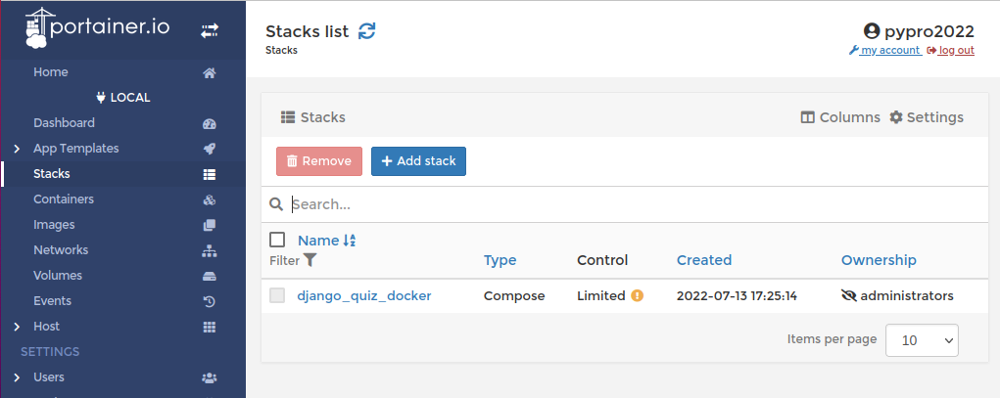
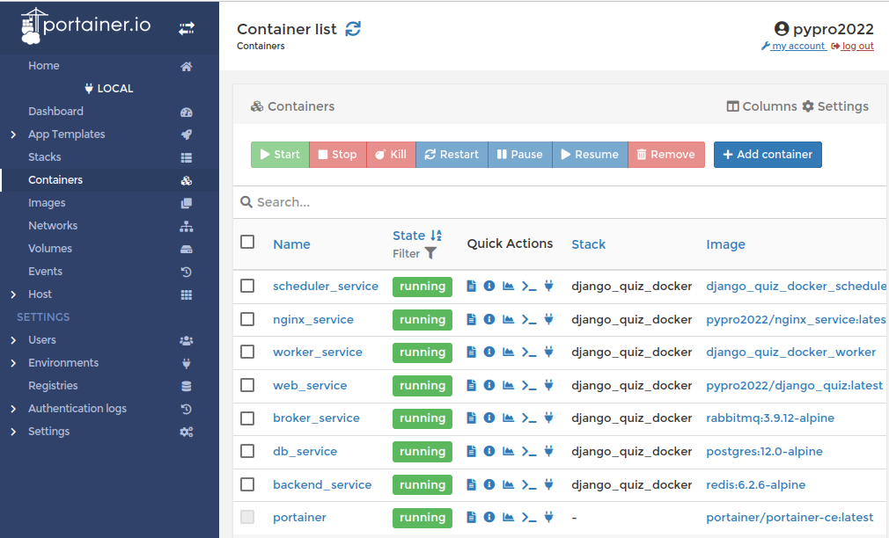

# DJANGO_QUIZ_DOCKER
-----------------------------------------------------------------------------------------------------------------------
Hillel python_advanced_15032022 learning project

Student: Кардашев Константин

------------------------------------------------------------------------------------------------------------------------

Тестовые аккаунты

    user_2 ||  user_2@test.com  || testpass1234 ||

    admin ||  admin@test.com  || superpass123 || 

------------------------------------------------------------------------------------------------------------------------
ДЗ 26. Работа с Docker (DZ26_DockerWorkflow)
------------------------------------------------------------------------------------------------------------------------

###СДЕЛАНО

[x] - Закинул всё с урока в проект

[х] - Переставил систему. Всё по новой.

[x] - Добавил get_or_create в модель аккаунта, чтобы не вылазило DoesNotExist исключение при регистраци.

[x] - Докинул лого сайта. Было в гитигноре.

[x] - Прибрал мусор. Подготовил проект к выгрузке на GH

###НЕ В КОММИТЕ

[x] - Добавил метод __str__ моделям в quiz

[x] - Запустил сборку. Потестил. Всё работает.

[x] - После запуска надо собирать статику, делать миграции, суперюзера и поднимать дамп. Это как-то можно прописать
в докер-файлах, но времени разбираться уже нет. 

[х] - Иногда при перезапуске статика отваливается. Приходится пересобирать.

[х] - .env специально добавил, для контроля. Debug==True. На амазоне отключу.

ссылки на имеджи: 

https://hub.docker.com/repository/docker/pypro2022/django_quiz

https://hub.docker.com/repository/docker/pypro2022/django_quiz_docker_worker

https://hub.docker.com/repository/docker/pypro2022/django_quiz_docker_scheduler

https://hub.docker.com/repository/docker/pypro2022/postgres

https://hub.docker.com/repository/docker/pypro2022/nginx_service

https://hub.docker.com/repository/docker/pypro2022/rabbitmq

https://hub.docker.com/repository/docker/pypro2022/redis

###КАРТИНКИ

------------------------------------------------------------------------------------------------------------------------
ДЗ 25. Создать Docker образ (DZ25_DockerImage)
------------------------------------------------------------------------------------------------------------------------
ссылка на имедж: https://hub.docker.com/repository/docker/pypro2022/django_quiz

###СДЕЛАНО

[x] - Начал работу над проектом. Добавил dokerfile, requirements. Создал папку src.

[x] - Добавил приложение quiz в папку src. Прописал settings и urls.

[x] - Создал docker image. Запустил. Потестил.

[x] - Закинул имедж на docker hub. 

[x] - Прибрал мусор. Подготовил проект к выгрузке на GH.
